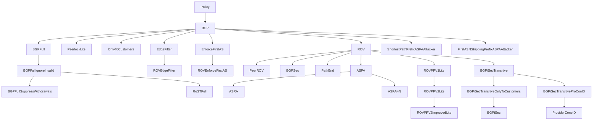

# BGPy Policy Inheritance Tree

## Primary Logic Tree

These classes contain actual routing logic. Each has a corresponding `Full` variant
(see table below) that adds RIBsIn/RIBsOut/withdrawal support via multiple inheritance.

```
Policy
└── BGP  (Gao-Rexford route selection, local_rib + recv_q)
    ├── BGPFull  (+ RIBsIn, RIBsOut, withdrawal support)
    │   ├── BGPFullIgnoreInvalid  (error_on_invalid_routes = False)
    │   │   ├── BGPFullSuppressWithdrawals  (suppress withdrawal propagation)
    │   │   └── RoSTFull  (trusted repository for withdrawal tracking)
    ├── PeerlockLite  (route-leak detection via input-clique check)
    ├── OnlyToCustomers  (OTC attribute enforcement)
    ├── EdgeFilter  (reject edge ASes claiming other ASNs)
    │   └── ROVEdgeFilter  (EdgeFilter + ROV validation)
    ├── EnforceFirstAS  (verify first ASN matches neighbor)
    │   └── ROVEnforceFirstAS  (EnforceFirstAS + ROV validation)
    └── ROV  (ROA-based origin validation)
        ├── PeerROV  (ROV restricted to peers only)
        ├── BGPSec  (cryptographic path signature verification)
        ├── PathEnd  (path-end record validation)
        ├── ASPA  (AS path validation via ASPA records)
        │   ├── ASRA  (ASPA + ASRA-B fake-link checks)
        │   └── ASPAwN  (ASPA neighbor-checking variant)
        ├── ROVPPV1Lite  (ROV + blackhole injection for invalid subprefixes)
        │   └── ROVPPV2Lite  (selective blackhole propagation)
        │       └── ROVPPV2ImprovedLite  (competing hijack protection)
        └── BGPiSecTransitive  (BGPSec + transitive path attributes)
            ├── BGPiSecTransitiveOnlyToCustomers  (+ OTC filtering)
            │   └── BGPiSec  (+ provider-cone ID validation)
            └── BGPiSecTransitiveProConID  (+ provider-cone validation)
                └── ProviderConeID  (extracted ProConeID logic)
```

---

## Full RIB Variants

Every Lite class above has a corresponding `Full` variant that mixes in `BGPFull`
(or `ROVFull`) using an empty class body:

```python
class ROVFull(ROV, BGPFull): pass
class ASPAFull(ASPA, ROVFull): pass
```

| Lite Class                         | Full Variant                              | Second Parent  |
|------------------------------------|-------------------------------------------|----------------|
| BGP                                | BGPFull                                   | (direct)       |
| ROV                                | ROVFull                                   | BGPFull        |
| PeerROV                            | PeerROVFull                               | ROVFull        |
| ASPA                               | ASPAFull                                  | ROVFull        |
| ASRA                               | ASRAFull                                  | ASPAFull       |
| ASPAwN                             | ASPAwNFull                                | ROVFull        |
| BGPSec                             | BGPSecFull                                | BGPFull        |
| PathEnd                            | PathEndFull                               | ROVFull        |
| ROVPPV1Lite                        | ROVPPV1LiteFull                           | ROVFull        |
| ROVPPV2Lite                        | ROVPPV2LiteFull                           | ROVFull        |
| ROVPPV2ImprovedLite                | ROVPPV2ImprovedLiteFull                   | ROVFull        |
| EdgeFilter                         | EdgeFilterFull                            | BGPFull        |
| ROVEdgeFilter                      | ROVEdgeFilterFull                         | BGPFull        |
| EnforceFirstAS                     | EnforceFirstASFull                        | ROVFull        |
| ROVEnforceFirstAS                  | ROVEnforceFirstASFull                     | ROVFull        |
| PeerlockLite                       | PeerlockLiteFull                          | BGPFull        |
| OnlyToCustomers                    | OnlyToCustomersFull                       | BGPFull        |
| BGPiSecTransitive                  | BGPiSecTransitiveFull                     | ROVFull        |
| BGPiSecTransitiveOnlyToCustomers   | BGPiSecTransitiveOnlyToCustomersFull      | ROVFull        |
| BGPiSecTransitiveProConID          | BGPiSecTransitiveProConIDFull             | ROVFull        |
| BGPiSec                            | BGPiSecFull                               | ROVFull        |
| ProviderConeID                     | ProviderConeIDFull                        | ROVFull        |

---

## Attacker Policies

Special policies that masquerade as legitimate policies during attack simulation.
They register under another policy's `.name`, overwriting it in `name_to_subclass_dict`.

| Class                                | Registered name | Masquerades as |
|--------------------------------------|-----------------|----------------|
| ShortestPathPrefixASPAAttacker       | "BGP"           | BGP            |
| FirstASNStrippingPrefixASPAAttacker  | (varies)        | BGP            |

---

## Mermaid Diagram (Lite Classes Only)

Full variants omitted for clarity; see table above for the full set.


